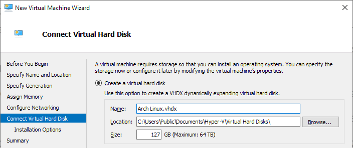

本文承接前文[安装Arch Linux前的准备工作](prepare-to-install-arch.md)，介绍利用Windows 10整合的Hyper-V技术，创建一台虚拟机并启动到Arch Linux安装介质以便安装的步骤。

## 启用Hyper-V & 创建虚拟机

可以参照官方[虚拟机安装指南](https://wiki.archlinux.org/index.php/Hyper-V)。这里为了方便读者，简单翻译一下。

### 启用Hyper-V

在开始菜单搜索并选择“Turn Windows features on or off”，找到“Hyper-V”并勾选，点击“OK”按钮。（勾选后为对勾抑或方块并不影响）


### 配置虚拟机网络（可选）

Arch Linux的安装和使用均需要连接到网络，因此要给虚拟机分配一个Virtual Switch（虚拟交换器）。这里有使用外部交换器和内部交换器两种选择。

因无特殊需求，用随Windows 10 Fall Creators Update更新而来的内建NAT internal switch——“Default Switch”即可。

### 创建虚拟机

1. 在开始菜单搜索并运行“Hyper-V Manager”。选择“New”，“Virtual Machine”，进入新建虚拟机向导。

   

2. 在“Specify Generation”时，选择“Generation 2”来使用UEFI环境。

   

3. 在“Assign Memory”时，选择恰当大小的内存，笔者使用了默认值。

4. 在“Configure Networking”时，“Connection”选择“Default Switch”

   

5. 在“Connect Virtual Hard Disk”时，选择“Create a virtual hard disk”

   

6. 在“Installation Options”时，选择“Install an operating system from a bootable CD/DVD-ROM”，并选择之前下载的Arch Linux ISO镜像

   

## 配置虚拟机

选择我们刚刚创建的虚拟机，打开其设置


- 关闭Secure Boot：

  

- 分配更多处理器核心（可选）：

  

## 连接并启动虚拟机

1. 连接并启动：双击创建的虚拟机，选择Start。

2. 自此可以开始在Arch Linux Live Environment中进行安装步骤，建议先测试网络可用性：

   ```bash
   ping baidu.com
   ```

[在虚拟机/实体机中安装Arch Linux](install-arch-on-laptop-and-vm.md)的步骤请移步后文。
