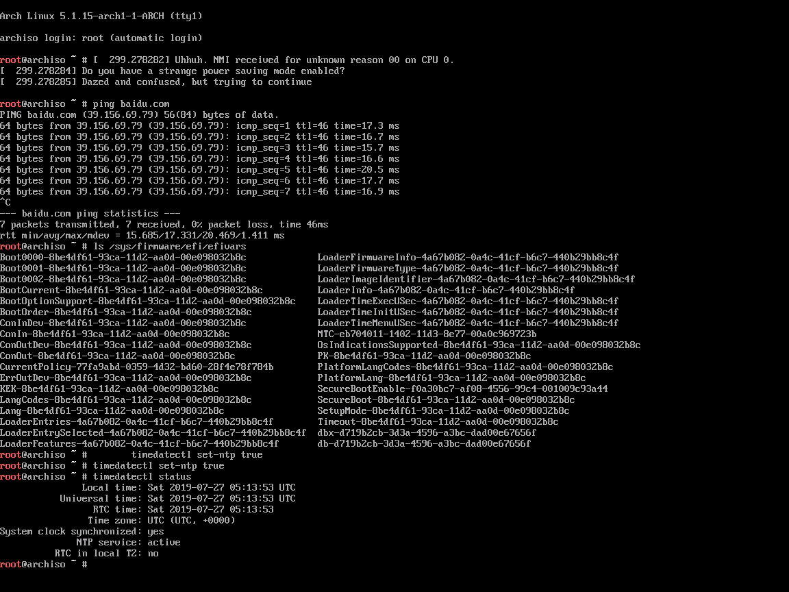
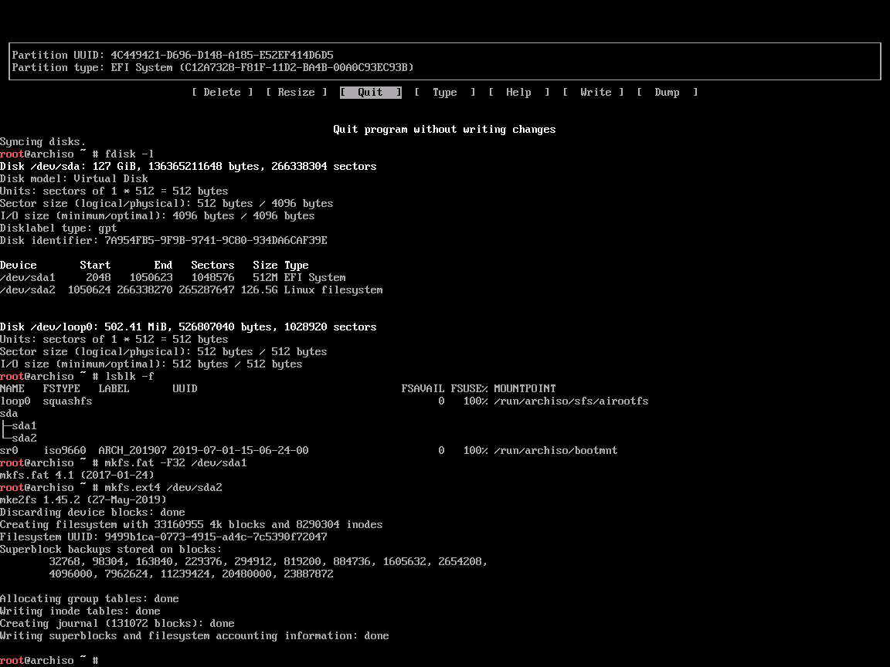
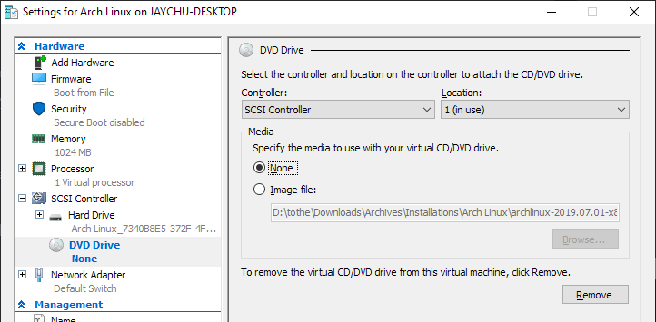
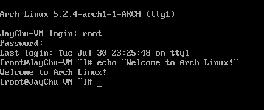

## 目录<!-- omit in toc -->

- [前言](#前言)
- [准备安装](#准备安装)
- [安装Arch Linux](#安装arch-linux)
- [配置系统](#配置系统)
- [重启](#重启)
- [安装完成后的工作](#安装完成后的工作)

## 前言

本文将承接前文[安装Arch Linux前的准备工作](prepare-to-install-arch.md)和[为Arch Linux创建Hyper-V虚拟机](create-vm-for-arch.md)，按步骤介绍在虚拟机以及物理机中安装Arch Linux的步骤。个别步骤虚拟机同物理机的操作不一致，后文中会注明，请注意区分。

以下参考官方[安装指南](https://wiki.archlinux.org/index.php/Installation_guide#Pre-installation)。

## 准备安装

启动机器前，请在机器固件设置（虚拟机配置或物理机主板配置）中打开UEFI模式。并且，俺建议和虚拟机安装过程一样关闭[Secure Boot](https://www.rodsbooks.com/efi-bootloaders/secureboot.html)。支持这一建议的[原因](https://www.reddit.com/r/archlinux/comments/8nbau0/secure_boot_yay_or_nay/)为——Secure Boot保护我们不受[Evil Maid Attack](https://en.wikipedia.org/wiki/Evil_maid_attack)之类物理攻击，但俺自用笔记本的环境几乎不存在收到这类攻击的可能，并且俺也不涉及绝密级别的工作。鉴于俺已经不熟练（xiǎng tōu lǎn）到BootLoader都不会装、全盘加密也不会做、sudoers还不会配的份儿上，这种Windows平台下主板里按个回车就能够轻松享受，Linux却要看半个小时才弄得好的只有理论价值的安全措施暂时就不考虑了。如果有需要可以参看官方[Secure Boot指南](https://wiki.archlinux.org/index.php/Secure_Boot)。

### 选择键盘布局

俺使用默认的US布局，故不做更改。

### 验证启动模式

运行如下命令，文件夹存在并有内容即正常。如不存在，则系统是在BIOS环境中启动的，请再次检查创建虚拟机时是否选择的Generation 2。（如是在物理机上安装，检查主板设置是否开启了UEFI模式。）

```bash
ls /sys/firmware/efi/efivars
```

### 连接到互联网

虚拟机之前已经配置了虚拟网络适配器，故跳过。

物理机安装时如使用有线连接，无需额外操作；而如需使用Wi-Fi连接，可以使用图形化工具：

```bash
wifi-menu -o
```

一般来说，`archboot`安装环境中已经包含了各种网卡的驱动，其中就有俺所需的高通专有驱动`broadcom-wl`。但如果工具仍然报错，请根据[无线网络配置](https://wiki.archlinux.org/index.php/Wireless_network_configuration)检查常见问题。

根据向导选择网络，输入密码之后，工具便会在`/etc/netctl`创建一个连接配置文件，接下来启动它：

> 用您指定的配置文件名称替换下文的`profile`，可在输入`start`和空格后，按`tab`键自动补全。

```bash
netctl start profile
```

如此便可连接上Wi-Fi网络。

### 更新系统时钟

```bash
timedatectl set-ntp true
```

检查时钟状态：

```bash
timedatectl status
```



### 磁盘分区

列出所有硬盘：

```bash
fdisk -l
```

寻找类似`/dev/sda`或者`/dev/nvme0n1`的条目，并根据磁盘的大小等信息，确定您想要安装的磁盘。

Linux系统需要至少一个root目录（`/`）分区，如果启用了UEFI，还需要一个[EFI系统分区](https://wiki.archlinux.org/index.php/EFI_system_partition)。[Swap](https://wiki.archlinux.org/index.php/swap)可以通过分区实现也可以通过动态Swap文件实现。

俺参考了官方分区模板，选择将磁盘分为512MB的EFI系统分区、利用全部剩余空间的Linux文件系统分区和一个8GB的Swap分区。Swap分区的大小可以参考It's FOSS上的[一篇文章](https://itsfoss.com/swap-size/)。一般来说设为物理内存的两倍肯定够用了。

分区时为了方便可以用[`fdisk`](https://wiki.archlinux.org/index.php/Fdisk)工具的图形版`cfdisk`

1. Select label type选择`gpt`（如果未提示，检查屏幕上方第三行是否为`Lable: gpt`）
2. New一个`512M`的分区，Type更改为`EFI System`
3. New一个大小为剩余空间-`8GB`（即`cfdisk`自动填写的大小减去`8GB`）的分区，并确保Type为`Linux filesystem`
4. New一个`8GB`的分区，Type更改为`Linux swap`
5. 选择Write将分区更改写到磁盘
6. Quit

### 格式化分区

刚创建好的分区是没有文件系统的，我们要自行创建文件系统。

> 可以用`fdisk -l`来查看分区大小，用`lsblk -f`来查看分区格式

将EFI系统分区格式化为FAT32格式，将Linux文件系统分区格式化为ext4格式：

> 如果您的分区名和下述不一致，请自行替换

```bash
mkfs.fat -F32 /dev/sda1
mkfs.ext4 /dev/sda2
```



如果之前创建了Swap分区，应将其启用：

```bash
mkswap /dev/sda3
swapon /dev/sda3
```

### 挂载分区

将Linux文件系统分区挂载为`/mnt`，将EFI系统分区挂载为`/mnt/boot`。

> 系统启动时，会在EFI系统分区寻找一个[Boot Loader](https://wiki.archlinux.org/index.php/Arch_boot_process#Boot_loader)、[Boot Manager](https://wiki.archlinux.org/index.php/Arch_boot_process#Boot_loader)或者使用[EFISTUB](https://wiki.archlinux.org/index.php/EFISTUB)方式直接启动Linux系统内核。由于俺在虚拟机及笔电中只安装一个系统，不涉及双系统及其他复杂情况，所以选择EFISTUB方式。
>
> 根据官方Wiki上关于[EFI系统分区挂载](https://wiki.archlinux.org/index.php/EFI_system_partition#Mount_the_partition)的说明，当选择EFISTUB直接启动的方法时，需将EFI系统分区挂载到`/boot`中。对应于我们将root挂载到`/mnt`的情况，应将EFI系统分区挂载到`/mnt/boot`目录。

```bash
mount /dev/sda2 /mnt
mkdir /mnt/boot
mount /dev/sda1 /mnt/boot
```

## 安装Arch Linux

### 选择镜像服务器

Arch Linux默认在线安装。此外，更新时也会通过镜像服务器下载软件包。镜像服务器的列表在`/etc/pacman.d/mirrorlist`中，在安装过程中会被自动拷贝到新系统。为了方便，此时就应选择一些连通性良好、速度够快的服务器，可以节省很多时间。

下载软件包时会自动按照列表中的先后顺序选择服务器。我们可以按照Wiki上关于[镜像服务器排序](https://wiki.archlinux.org/index.php/Mirrors#Sorting_mirrors)的说明测试并修改列表：

```bash
pacman -S reflector
reflector --country China --sort rate --save /etc/pacman.d/mirrorlist
```

也可以手动编辑，将自己喜好的镜像服务器放置在列表的前列：

- 如不想用Vim/Nano等命令行文本编辑器的话，可以直接用某个服务器地址覆写列表文件：

  ```bash
  echo Server = https://mirrors.tuna.tsinghua.edu.cn/archlinux/$repo/os/$arch > /etc/pacman.d/mirrorlist
  ```

- 如果希望再附加一两行服务器，用`>>`来在文件末尾附加新内容，例如：

  ```bash
  cat >> /etc/pacman.d/mirrorlist
  Server = https://mirrors.sjtug.sjtu.edu.cn/archlinux/$repo/os/$arch
  Server = http://mirrors.163.com/archlinux/$repo/os/$arch
  ```

最后检查文件内容：

```bash
cat /etc/pacman.d/mirrorlist
```

### 安装必要的软件包

下载并安装Arch Linux，会花费大约三分钟：

```bash
pacstrap /mnt base linux linux-firmware
```

注意：从2019年10月6日起，base软件包组被同名的新base软件包[替换](https://www.archlinux.org/news/base-group-replaced-by-mandatory-base-package-manual-intervention-required/)，而且此软件包中不再包含`linux`、`linux-firmware`、`netctl`、`vi`等软件包。俺已经根据这一变化、重新安装了系统并更新了这篇文章。

这一改动的好处在于日后`base`中添加的新成员可以跟随`base`的更新而自动安装。排除一些非必须的软件包可以方便诸如进行批量部署的运维人员自定义需要的部件。大家都可以安装自己需要的内核（`linux`）、文本编辑器（`neovim`）、网络管理器（`networkmanager`）、固件（`broadcom-wl-dkms`）等等，而不必用`ignore`来排除或安装后删除又或者不管不顾造成冗余。

如果之前选择的镜像服务器不好用，可以`ctrl+c`中止下载并重新选择服务器。下次`pacman`会从中止的软件包开始续传。

> 注：此时便可在命令后面续写其他想要安装的软件包名，用空格隔开。这些软件包会被直接安装到新系统中。但是部分软件报的安装可能需要附加脚本等，用`pacstrap`安装可能会有问题，俺的建议是在初体验Arch安装、未经实践的情况下，只安装原`base`和`base-devel`这类明确适配`pacstrap`设计的软件包。其余的软件包在chroot和重启到新系统之后再行安装。

## 配置系统

### Fstab

创建[fstab](https://wiki.archlinux.org/index.php/Fstab)文件，用`-U`或`-L`来指定用[UUID](https://wiki.archlinux.org/index.php/UUID)还是标签来标识（建议使用UUID）：

```bash
genfstab -U /mnt >> /mnt/etc/fstab
```

检查生成的文件：

```bash
cat /mnt/etc/fstab
```

### Chroot

变更可见根目录到新系统中，开始新系统的设置：

```bash
arch-chroot /mnt
```

### 时区

设置时区（亚洲/上海）：

```bash
ln -sf /usr/share/zoneinfo/Asia/Shanghai /etc/localtime
```

将硬件时钟设置为与系统时钟相同：

```bash
hwclock --systohc
```

### 本地化

程序和系统均需要用[Locale](https://wiki.archlinux.org/index.php/Locale)来确定地域、货币、时间日期格式等等。要使用某个locale设置，就要先生成它。有时候，在系统使用过程中即使自己只用到一套locale，也要为了支持切换、或者支持此电脑上的其他用户对不同的locale的需要，将所有可能用到的locale都一并生成。

移除`/etc/locale.gen`中您需要的locale前的`#`号注释。可以用Nano/Vi(m)等工具修改，也可以用`cat`命令直接编写，例如：

```bash
cat > /etc/locale.gen
en_US.UTF-8 UTF-8
ja_JP.UTF-8 UTF-8
zh_CN.UTF-8 UTF-8
zh_TW.UTF-8 UTF-8
# ctrl+d
```

> 最后一行表示用组合键`ctrl+d`输入文件终止符`EOF`来完成该文件的编写。详见[Linux系统输入输出重定向简介](https://www.digitalocean.com/community/tutorials/an-introduction-to-linux-i-o-redirection)。
>
> 注：建议选择UTF-8字符集的locale。

之后生成locale讯息：

```bash
locale-gen
```

创建`locale.conf`文件，设置`LANG`变量：

```bash
echo LANG=en_US.UTF-8 > /etc/locale.conf
```

> 注：建议操作系统均使用英文locale，这样终端内的输出、软件报错信息均为英语，便于Google搜索和问题分享等等。反之，设置成汉字语系的locale还可能导致TTY乱码。

之后设置新系统的键盘布局，由于俺用默认的US键盘布局，故跳过。

### 网络配置

创建[hostname](https://wiki.archlinux.org/index.php/Hostname)文件：

> 用您喜欢的主机名替换`myhostname`。

```bash
echo myhostname > /etc/hostname
```

创建对应的[hosts](https://jlk.fjfi.cvut.cz/arch/manpages/man/hosts.5)文件：

```bash
cat > /etc/hosts
127.0.0.1 localhost
::1 localhost
127.0.1.1 myhostname.localdomain myhostname
# ctrl+d
```

> 如果此系统有一个永久IP地址，应该用此地址替换`127.0.1.1`。

完成其他[网络配置](https://wiki.archlinux.org/index.php/Network_configuration)：

- 虚拟机：

  对于虚拟机，只需要启动[`dhcpcd`](https://wiki.archlinux.org/index.php/Dhcpcd#Running)服务即可：

  ```bash
  systemctl enable dhcpcd
  ```

- 物理机：

  如使用有线网络连接，同上述虚拟机配置一样只需启动`dhcpcd`服务即可。如需在新系统中继续使用Wi-Fi，则建议安装一个[网络管理器](https://wiki.archlinux.org/index.php/Network_configuration#Network_managers)。

  鉴于KDE等[桌面环境](https://wiki.archlinux.org/index.php/Desktop_environment)常使用`networkmanager`来管理网络连接，并且此包会在安装KDE桌面环境时作为依赖自动安装。俺建议在`netctl`被移出`base`的当下，直接作为依赖包安装`networkmanager`来联网。

  ```bash
  pacman -S networkmanager --asdep
  systemctl enable networkmanager
  ```

  此外，关于无线网卡驱动，俺的笔电使用的无线网卡芯片为高通的BCM43142，不被高通官方开源网卡驱动支持。而官方的专有驱动[`wl`](https://wiki.archlinux.org/index.php/Broadcom_wireless#broadcom-wl)则似乎由于知识产权问题，不能由其他组织分发，所以没能被集成在Linux操作系统内核自带固件全家桶`linux-firmware`中，必须由用户自行安装。所幸该驱动有一种可以支持dkms技术、随Linux系统内核更新自动适配的版本，所以这里俺安装网卡驱动的dkms版：

  ```bash
  pacman -S linux-headers broadcom-wl-dkms
  ```

### Initramfs

一般来说不需要创建新的initramfs，除非想要使用[LVM](https://wiki.archlinux.org/index.php/LVM#Configure_mkinitcpio)，[系统加密](https://wiki.archlinux.org/index.php/Dm-crypt)，或者[RAID](https://wiki.archlinux.org/index.php/RAID#Configure_mkinitcpio)等进阶技术。这里跳过。

### Root密码

设置[root账户密码](https://wiki.archlinux.org/index.php/Password)：

```bash
passwd
```

### Boot loader

这是重启到新系统前最后的步骤了，以下参考了[Arch启动过程#Boot loader](https://wiki.archlinux.org/index.php/Arch_boot_process#Boot_loader)来配置系统的Boot loader。

鉴于选择了EFISTUB启动方法，故参考[Using UEFI directly](https://wiki.archlinux.org/index.php/EFISTUB#Using_UEFI_directly)来进行配置。

如果是在**物理机**上安装，配置EFISTUB启动时还多一首小插曲——[Microcode](https://wiki.archlinux.org/index.php/Microcode)，即根据处理器品牌，配置早期微码更新。Intel处理器的操作如下，Amd处理器需要将`intel`替换为`amd`：

```bash
pacman -S intel-ucode
```

> 虚拟机上[不需要考虑Microcode](https://wiki.archlinux.org/index.php/Microcode#EFISTUB)

之后编写EFISTUB启动项的脚本：

1. 首先用`exit`命令或者组合键`ctrl+d`退出chroot环境。
2. 创建一个脚本文件来存贮将要执行的一条长命令，方便我们检查和修改参数：

   ```bash
   vi efibootmgr.sh
   ```

   > 不用Vi(m)也可以用Nano等编辑器或者`cat`、`echo`等命令。但之后输入[分区UUID](https://wiki.archlinux.org/index.php/Persistent_block_device_naming#by-partuuid)俺是用Vi(m)的[`:read`](https://vim.fandom.com/wiki/Append_output_of_an_external_command#Using_:read)命令完成的。
   >
   > #### 一点Vi的小说明
   >
   > 进入Vi后是普通模式。
   >
   > 普通模式下按`h` `j` `k` `l`分别向←↓↑→移动光标。按`i`进入插入模式开始键入文字。
   >
   > 按`Esc`从各种模式返回普通模式。
   >
   > 普通模式下键入`:`和命令并回车来执行Vi命令，例如`:q`在未修改文件的情况下退出、`:q!`放弃修改并退出、`:w`保存、`:wq`/`:x`保存并退出等。上述`:read`也是如此执行。
   >
   > 普通模式下键入`dd`来剪切当前行，`p`来粘贴，`J`（即`shift+j`）来将下一行接到当前行末尾。
   >
   > 更多Vi(m)技巧请您自行了解，不在此赘述。

3. 在其中写入如下内容：

   > 将下文`/dev/sda`和`1`替换为您的EFI系统分区（ESP）的磁盘和分区号。`--disk /dev/sda --part 1`对应的是俺之前创建的ESP——`/dev/sda1`。

   - 虚拟机：

     ```bash
     efibootmgr --disk /dev/sda --part 1 --create --label "Arch Linux" --loader /vmlinuz-linux --unicode 'root=PARTUUID=XXXXXXXX-XXXX-XXXX-XXXX-XXXXXXXXXXXX rw initrd=/initramfs-linux.img' --verbose
     ```

   - 物理机：

     > 多一段启动Microcode的`initrd=/intel-ucode.img`

     ```bash
     efibootmgr --disk /dev/sda --part 1 --create --label "Arch Linux" --loader /vmlinuz-linux --unicode 'root=PARTUUID=XXXXXXXX-XXXX-XXXX-XXXX-XXXXXXXXXXXX rw initrd=/intel-ucode.img initrd=/initramfs-linux.img' --verbose
     ```

4. 将`root=`之后的PARTUUID的参数替换成Linux文件系统分区（即`/dev/sda2`）的分区UUID。手动输入比较麻烦，这里俺使用的Vi(m)的`:read`命令，让Vi(m)将`:read !`后面的文字当作Shell命令执行，并将结果另起一行写在文件中。

   ```vim
   :read !lsblk -dno PARTUUID /dev/sda2
   ```

   > 注意：默认情况下Vi会[防止](https://vi.stackexchange.com/a/2163/22060)用户使用退格键删除`自动缩进`、`换行符`以及`进入插入模式时的位置`之前的字符的。要么直接在普通模式下用`J`（大写J）将下一行接到当前行末尾，要么临时`:set backspace=indent,eol,start`。

5. 检查脚本中内容：

   ```bash
   cat efibootmgr.sh
   fdisk -l
   lsblk -dno PARTUUID /dev/sda2
   ```

6. 确认无误后，可将该脚本在机器磁盘中备份一份（可选），赋予该脚本可执行权限，并运行：

   ```bash
   cp efibootmgr.sh /mnt/home
   chmod u+x efibootmgr.sh
   ./efibootmgr.sh
   ```

7. 再次检查启动项是否配置无误：

   ```bash
   efibootmgr --verbose
   ```

8. 设置启动顺序（可选）：

   > 运行完脚本后，efibootmgr自动将`Arch Linux`项设置为第一启动项，故此步骤可以跳过。

   ```bash
   efibootmgr --bootorder XXXX,XXXX --verbose
   ```

   其中XXXX即efibootmgr的输出中各启动项前的四位数。

   > 俺在笔电上安装时会将U盘设为第一项，系统设为第二项，主板固件设置设为第三项。关机之后移除U盘便可从硬盘系统启动。之后若无法启动或缺少驱动，下次启动前插入U盘便能进入安装环境进行急救。确认启动正常后，可用`systemctl reboot --firmware-setup`重启到主板设置将系统调回第一项。

## 重启

1. 用组合键`ctrl+d`或者命令退出chroot环境：

   ```bash
   exit
   ```

2. 卸载文件系统：

   ```bash
   umount -R /mnt
   ```

   如果文件系统正处于使用中，可以用[fuser(1)](https://jlk.fjfi.cvut.cz/arch/manpages/man/fuser.1)找到。

3. 关机：

   ```bash
   shutdown now
   ```

   所有仍然挂载的文件系统会被*systemd*自动卸载。

   移除安装介质：

   - 虚拟机

     在虚拟机设置中将SCSI控制器里的DVD驱动器中的安装镜像关掉。

     

   - 物理机

     确认关机后移除U盘即可。

4. 再次启动并用设置好的密码登录root账户后，终于进入了Arch Linux。

   

## 安装完成后的工作

至此，我们便可以在Hyper-V虚拟机/物理机中运行最小化的Arch Linux系统，以及进行网络连接。

您可以进一步参考官方[推荐的安装完成后的操作](https://wiki.archlinux.org/index.php/General_recommendations)。包括但不限于：

- 创建用户账户、配置`sudo`
- 安装蓝牙、显卡等的闭源驱动
- 配置无线网络连接
- 安装桌面环境
