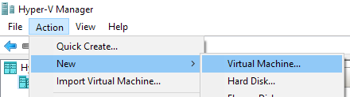
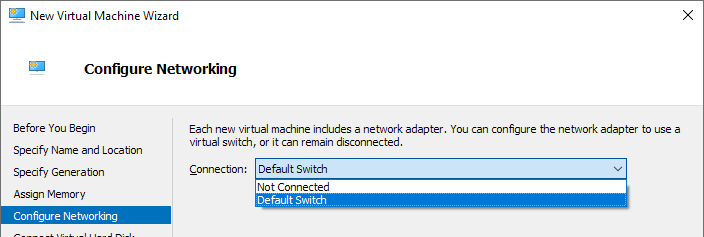

## 前言

作为可能投放在个人博客上的第一篇文章，打算随便记录点自己前几天在笔记本电脑和台式机上安装Arch Linux的过程。我~~可怜又可爱~~的小笔记本电脑从高中二年级的时候就一直稳健地发挥着其热量，直到如今大学毕业。其硬盘、CPU、内存难以满足当下一套Windows 10 + Firefox Quantum + Electron App(Visual Studio Code / Trello)的欲求。恰巧最近想要在Linux环境下学习一些别的框架，挑挑拣拣便看中了这个配置相对复杂但是内容简化的Arch Linux + KDE往笔电上试着装了装。

此文不妄为各位读者解惑，仅仅能够作为下次安装或给同学朋友的参考便好。如对网络另一端的他人能有所帮助，不胜荣幸。

在尝试在一台物理机器上安装Arch Linux之前，不妨在已有的虚拟机中体验一下安装Arch Linux的全过程。虚拟机安装过程中，可以直接使用原生系统的软硬件阅读安装指南、进行资料的搜索，更为便利。同时，如果遇到困难想中途停止安装，也可以轻松还原。

本文描述笔者在一台Windows 10 机器上，从开启Windows 10自带虚拟机功能，到可以在虚拟机中运行有网络连接的Arch Linux的过程。

> 笔者是在下述虚拟机环境上安装的Arch Linux：
>
> 操作系统：Windows 10 Pro 1903 18362.239
> 虚拟技术：Hyper-V
>
> 并不清楚Hyper-V与Oracle VM VirtualBox上仅仅是进行Arch Linux安装，会有什么体验上的不同。之前已经试过VirtualBox，此次为了少安装一个第三方软件尝试一下微软的Hyper-V。

## 下载 & 校验Arch Linux ISO安装镜像

我们可以按照官方[安装指南](https://wiki.archlinux.org/index.php/Installation_guide#Pre-installation)来下载和校验安装镜像。

### 下载

在[官网下载](https://www.archlinux.org/download/)镜像时，可选择使用[网易](http://mirrors.163.com/archlinux/iso/2019.07.01/)等速度较快的镜像服务器。

### 校验

1. Windows下可直接用`certutil`校验SHA1：

   > 以下将`version`替换为您下载到的镜像的版本。

   ```powershell
   certutil -hashfile archlinux-version-x86_64.iso.sig sha1
   ```

2. 或者校验PGP签名。Windows下可以使用[Gpg4win](https://www.gpg4win.org/)，安装前确认UAC提示的安装包签名是否正确。

3. 将下载来的Arch Linux ISO安装镜像和PGP签名文件放在同一文件夹下，之后在此文件夹运行PowerShell或Command Prompt。

4. 运行命令：

   ```powershell
   gpg --keyserver-options auto-key-retrieve --verify archlinux-version-x86_64.iso.sig
   ```

5. 看到`Good signature from`等即表明文件的**完整性**符合签名描述：

   ```bash
   gpg: assuming signed data in '.\archlinux-2019.07.01-x86_64.iso'
   gpg: Signature made 07/01/19 23:07:38 China Standard Time
   gpg:                using RSA key 4AA4767BBC9C4B1D18AE28B77F2D434B9741E8AC
   gpg: C:/Users/tothe/AppData/Roaming/gnupg/trustdb.gpg: trustdb created
   gpg: key 7F2D434B9741E8AC: public key "Pierre Schmitz <pierre@archlinux.de>" imported
   gpg: Total number processed: 1
   gpg:               imported: 1
   gpg: Good signature from "Pierre Schmitz <pierre@archlinux.de>" [unknown]
   gpg: WARNING: This key is not certified with a trusted signature!
   gpg:          There is no indication that the signature belongs to the owner.
   Primary key fingerprint: 4AA4 767B BC9C 4B1D 18AE  28B7 7F2D 434B 9741 E8AC
   ```

6. 其中的`WARNING`表示此密钥并[没有被信任或者是伪造的](https://gnupg.org/download/integrity_check.html#sec-1-1)。依据[安装指南#校验签名](https://wiki.archlinux.org/index.php/Installation_guide#Verify_signature)，我们需要检查签名者信息以及`fingerprint`来确认其是否可信。

7. 根据Arch Linux官网的[开发人员信息](https://www.archlinux.org/people/developers/#pierre)我们可以找到并确认这个公钥。

   > 当然我们也需要确认页面的可信任性等等，这里不再[详述](https://pierre-schmitz.com/trust-the-master-keys/)。

## 启用Hyper-V & 创建虚拟机

可以参照官方[虚拟机安装指南](https://wiki.archlinux.org/index.php/Hyper-V)。这里为了方便读者，简单提炼和翻译一下。

### 启用Hyper-V

在开始菜单搜索并选择“Turn Windows features on or off”，找到“Hyper-V”并勾选，点击“OK”按钮。（勾选后为对勾抑或方块并不影响）


### 配置虚拟机网络（可选）

Arch Linux的安装和使用均需要让虚拟机也连接到网络，因此要给虚拟机分配一个Virtual Switch（虚拟交换器）。这里有使用外部交换器和内部交换器两种选择。

无特殊需求，我们之后用随Windows 10 Fall Creators Update更新而来的内建NAT internal switch——名叫“Default Switch”者即可。

### 创建虚拟机

1. 在开始菜单搜索并运行“Hyper-V Manager”。选择“New”，“Virtual Machine”，进入新建虚拟机向导。

   

2. 在“Specify Generation”时，选择“Generation 2”来使用UEFI环境。注：之后记得在虚拟机设置里关闭“Secure Boot”。

   

3. 选择恰当大小的内存

4. 在“Configure Networking”时，“Connection”选择“Default Switch”

   

5. 在“Connect Virtual Hard Disk”时，选择“Create a virtual hard disk”

   

6. 在“Installation Options”时，选择“Install an operating system from a bootable CD/DVD-ROM”，并选择之前下载的Arch Linux ISO镜像

   

## 配置虚拟机

选择我们刚刚创建的虚拟机，打开其设置


- 关闭Secure Boot：

  

- 分配更多处理器核心（可选）：

  

## 启动并连接到虚拟机

1. 启动并连接：右键我们创建的虚拟机，选择Start，再次右键，选择Connect

   

2. 自此可以开始在Arch Linux Live Environment中进行安装步骤，先测试网络可用性：

   ```bash
   ping baidu.com
   ```

## 安装Arch Linux之前的准备工作

   下述内容参考官方[安装指南](https://wiki.archlinux.org/index.php/Installation_guide#Pre-installation)。

### 选择键盘布局

笔者使用默认的US布局，故不做更改。

### 验证启动模式

运行如下命令，文件夹中存在即正常。如不存在，则表示系统是在BIOS环境中启动的，请再次检查创建虚拟机时是否选择的Generation 2。（如是在实体机上安装的，检查主板设置是否开启了UEFI模式。）

```bash
ls /sys/firmware/efi/efivars
```

### 连接到互联网

此次在虚拟机中安装之前，已经配置了虚拟网络适配器，故跳过。

### 更新系统时钟

```bash
timedatectl set-ntp true
```

检查时钟状态：

```bash
timedatectl status
```


### 磁盘分区

列出所有硬盘：

```bash
fdisk -l
```

我们需要找的是类似`/dev/sda`或者`/dev/nvme0n1`的条目，根据磁盘的大小等信息，确定您想要安装的磁盘。

Arch Linux需要至少一个root目录（`/`），如果启用了UEFI，还需要一个[EFI系统分区](https://wiki.archlinux.org/index.php/EFI_system_partition)。Swap可以不通过分区实现而是通过动态Swap文件实现。

参考官方给出的分区模板，我们可以将磁盘分为512MB的EFI系统分区和剩余空间的Linux文件分区。

分区时为了方便可以用[`fdisk`](https://wiki.archlinux.org/index.php/Fdisk)工具的图形版`cfdisk`

1. `Select label type`选择`gpt`
2. `New`一个`512M`的分区，`Type`更改为`EFI System`
3. `New`一个大小为剩余空间（即`cfdisk`自动填写的大小）的分区，并确保`Type`为`Linux filesystem`
4. 选择`Write`将分区更改写到磁盘
5. `Quit`


### 格式化分区

刚创建好的分区是没有文件系统的，我们要自行创建文件系统。

> 可以用`fdisk -l`来查看分区大小，用`lsblk -f`来查看分区格式

将EFI系统分区格式化为FAT32格式，将Linux文件系统分区格式化为ext4格式：

> 如果您的分区名和下述不一致，请自行替换

```bash
mkfs.fat -F32 /dev/sda1
mkfs.ext4 /dev/sda2
```


### 挂载分区

将Linux文件系统分区挂载为`/mnt`，将EFI系统分区挂载为`/mnt/boot`。

> 系统启动时会在EFI系统分区寻找一个[Boot Loader](https://wiki.archlinux.org/index.php/Arch_boot_process#Boot_loader)/[Boot Manager](https://wiki.archlinux.org/index.php/Arch_boot_process#Boot_loader)或者使用[EFISTUB](https://wiki.archlinux.org/index.php/EFISTUB)方式直接启动Linux系统内核。由于笔者在虚拟机以及自家的电脑中只安装一个系统，不涉及双系统及其他复杂情况，所以选择EFISTUB方式。
>
> 根据官方Wiki上关于[EFI系统分区挂载](https://wiki.archlinux.org/index.php/EFI_system_partition#Mount_the_partition)的说明，当选择EFISTUB直接启动的方法时，需要将EFI系统分区挂载到`/boot`中。对应于我们将root挂载到`/mnt`的情况，应将EFI系统分区挂载到`/mnt/boot`目录。

```bash
mount /dev/sda2 /mnt
mkdir /mnt/boot
mount /dev/sda1 /mnt/boot
```

## 安装Arch Linux

### 选择镜像服务器

Arch Linux默认使用在线安装方式，在安装以及日后更新时，都会用镜像服务器下载软件包。镜像服务器的列表在`/etc/pacman.d/mirrorlist`中，安装过程中会被自动拷贝到新系统中使用。为了便利，此时就选择一些连通性良好、速度够快的服务器可以节省很多时间。

下载软件包时会自动按照列表中的先后顺序选择服务器。我们可以按照Wiki上关于[镜像服务器排序](https://wiki.archlinux.org/index.php/Mirrors#Sorting_mirrors)的说明测试并修改列表，也可以手动编辑列表，将自己喜好的镜像服务器放置在列表的前列。

- 如果不想用诸如Vim/Nano等命令行文本编辑器的话，可以直接用某个服务器覆写列表文件：

  ```bash
  echo Server = https://mirrors.tuna.tsinghua.edu.cn/archlinux/$repo/os/$arch > /etc/pacman.d/mirrorlist
  ```

- 如果希望再附加一两行服务器，用`>>`替换上述命令的`>`来在文件末尾附加新内容，例如：

  ```bash
  echo Server = http://mirrors.163.com/archlinux/$repo/os/$arch >> /etc/pacman.d/mirrorlist
  ```

- 检查文件的内容：

  ```bash
  cat /etc/pacman.d/mirrorlist
  ```

### 安装`base`软件包组

下载并安装Arch Linux，会花费大约三分钟：

```bash
pacstrap /mnt base
```

出现`Proceed with installation`时，记得输入`y`并回车。

如果之前选择的镜像服务器不好用，可以`ctrl+c`中止下载并重新选择服务器。

## 配置系统

### Fstab

创建一个[fstab](https://wiki.archlinux.org/index.php/Fstab)文件，用`-U`或`-L`来指定用[UUID](https://wiki.archlinux.org/index.php/UUID)还是标签（建议使用UUID）：

```bash
genfstab -U /mnt >> /mnt/etc/fstab
```

检查生成的文件，如果发现错误修改掉：

```bash
cat /mnt/etc/fstab
```

### Chroot

变更可见根目录到新系统中，开始新系统的设置：

```bash
arch-chroot /mnt
```

### 时区

设置时区（亚洲/上海）：

```bash
ln -sf /usr/share/zoneinfo/Asia/Shanghai /etc/localtime
```

将硬件时钟设置为与系统时钟相同：

```bash
hwclock --systohc
```

### 本地化

程序和系统均需要用[Locale](https://wiki.archlinux.org/index.php/Locale)来确定地域、货币、时间日期格式等等。要使用某个locale设置，就要先生成它。有时候，即使自己在系统使用过程中可能只用到一套locale，但为了支持切换、或者支持此电脑上的其他用户对不同的locale的需要，就要将所有可能用到的locale都一并生成。

移除`/etc/locale.gen`中您需要的locale前的`#`号注释。可以用Nano/Vi(m)等工具修改，也可以用`cat`命令直接编写，例如：

```bash
cat > /etc/locale.gen
en_US.UTF-8 UTF-8
ja_JP.UTF-8 UTF-8
zh_CN.UTF-8 UTF-8
zh_TW.UTF-8 UTF-8
# ctrl+d
```

> 最后一行表示用组合键`ctrl+d`输入文件终止符`EOF`来完成该文件的编写。详见[Linux系统输入输出重定向简介](https://www.digitalocean.com/community/tutorials/an-introduction-to-linux-i-o-redirection)。
>
> 备注：建议使用UTF-8字符集

之后生成locale讯息：

```bash
locale-gen
```

创建`locale.conf`文件，并设置`LANG`变量：

```bash
echo LANG=en_US.UTF-8 > /etc/locale.conf
```

> 备注：建议操作系统均使用英文locale，这样终端内的输出、软件报错信息均为英语，便于Google搜索和问题分享等等。反之，设置成汉字语系的locale则有可能导致TTY乱码。

之后可以设置新系统的键盘布局，由于笔者用默认的US键盘布局，故跳过。

### 网络配置

创建[hostname](https://wiki.archlinux.org/index.php/Hostname)文件（用您喜欢的主机名替换下列命令的`myhostname`）：

```bash
echo myhostname > /etc/hostname
```

并创建对应的[hosts](https://jlk.fjfi.cvut.cz/arch/manpages/man/hosts.5)文件：

```bash
cat > /etc/hosts
127.0.0.1 localhost
::1 localhost
127.0.1.1 myhostname.localdomain myhostname
# ctrl+d
```

> 如果此系统有一个永久IP地址，应该用此地址替换`127.0.1.1`。

完成其他[网络配置](https://wiki.archlinux.org/index.php/Network_configuration)，对于此虚拟机，只需要启动[`dhcpcd`](https://wiki.archlinux.org/index.php/Dhcpcd#Running)服务即可：

```bash
systemctl enable dhcpcd
```

### Initramfs

一般来说不需要创建新的initramfs，除非想要使用[LVM](https://wiki.archlinux.org/index.php/LVM#Configure_mkinitcpio)，[系统加密](https://wiki.archlinux.org/index.php/Dm-crypt)，或者[RAID](https://wiki.archlinux.org/index.php/RAID#Configure_mkinitcpio)等进阶技术。这里跳过。

### Root密码

设置[root账户密码](https://wiki.archlinux.org/index.php/Password)：

```bash
passwd
```

### Boot loader

这是重启到我们的新系统前最后的步骤了，参考[Arch启动过程#Boot loader](https://wiki.archlinux.org/index.php/Arch_boot_process#Boot_loader)来配置系统的Boot loader。

本文中之前选择了EFISTUB启动方法，从UEFI直接启动，所以参考[Using UEFI directly](https://wiki.archlinux.org/index.php/EFISTUB#Using_UEFI_directly)来进行配置。

1. 首先创建一个脚本文件来存贮接下来要执行的一条比较长的命令，方便我们检查和修改：

   ```bash
   vi /home/efibootmgr.sh
   ```

   > - 不用Vi也可以用Nano等编辑器或者`cat`、`echo`等命令。但是之后有一个输入[分区UUID](https://wiki.archlinux.org/index.php/Persistent_block_device_naming#by-partuuid)的环节，笔者是用Vi的[`:read`](https://vim.fandom.com/wiki/Append_output_of_an_external_command#Using_:read)命令完成的。
   >
   > - 新系统中没有Vim、efibootmgr等工具。如果用`exit`命令或者组合键`ctrl+d`退出了chroot环境，记得将`/home/efibootmgr.sh`路径替换成`/mnt/home/efibootmgr.sh`。
   >
   > #### 一点Vi的小说明
   >
   > 进入Vi后在普通模式，在普通模式下按`h` `j` `k` `l`分别向←↓↑→移动光标。按`i`进入插入模式开始键入文字。
   >
   > 按`Esc`从包括插入模式等模式，返回到普通模式。
   >
   > 在普通模式下键入`:`和命令并回车来执行Vi命令，例如`:q`在未修改文件的情况下退出、`:q!`来放弃修改并退出、`:w`来保存、`:wq`或`:x`来保存并退出等。之前的`:read`也是如此。
   >
   > 在普通模式下键入`dd`来剪切当前行，`p`来粘贴。
   >
   > 更多内容就需要您自行了解了，在此不在赘述。

2. 在其中写入如下内容：

   ```bash
   efibootmgr --disk /dev/sdX --part Y --create --label "Arch Linux" --loader /vmlinuz-linux --unicode 'root=PARTUUID=XXXXXXXX-XXXX-XXXX-XXXX-XXXXXXXXXXXX rw initrd=\initramfs-linux.img' --verbose
   ```

3. 将`/dev/sdX`和`Y`替换为EFI系统分区（ESP）的磁盘和分区号，例如，本文之前挂载时，ESP对应的是`/dev/sda1`，那么`X`即`a`，`Y`即`1`。

4. 将`root=`之后的PARTUUID的参数替换成Linux文件系统分区（即`/dev/sda2`）的分区UUID。手动输入比较麻烦，这里笔者使用的Vi的`:read`命令，让Vi将`:read !`后面的文字当作可以在bash中执行的命令执行，并将结果另起一行写在文件里。

   ```vim
   :read !lsblk -dno PARTUUID /dev/sda2
   ```

   > 注意，默认情况下Vi会[防止](https://vi.stackexchange.com/a/2163/22060)用户使用退格键删除`自动缩进`、`换行符`以及`进入插入模式时的位置`之前的字符的。要么我们临时`:set backspace=indent,eol,start`，要么直接在普通模式下用`J`（大写J）将当前行末尾的换行符删除。

5. 笔者还在配置了[Microcode](https://wiki.archlinux.org/index.php/Microcode)自动更新，Intel处理器的操作如下，Amd处理器需要将`intel`替换为`amd`：

   1. 安装`intel-ucode`包（需要在chroot下进行）：

      ```bash
      pacman -S intel-ucode
      ```

   2. 将之前脚本中的`initrd=\initramfs-linux.img`前加一项`initrd=\intel-ucode.img`（注意用空格隔开两项）。

6. 现在检查脚本中内容是否有错：

   ```bash
   cat /home/efibootmgr.sh
   fdisk -l
   lsblk -dno PARTUUID /dev/sda2
   ```

7. 确认无误后赋予该脚本可执行权限并运行：

   ```bash
   chmod +x /home/efibootmgr.sh
   /home/efibootmgr.sh
   ```

8. 可以用如下命令再次检查启动项是否配置无误：

   ```bash
   efibootmgr --verbose
   ```

9. 正确后设置启动顺序：

   > 笔者运行完脚本后，efibootmgr已经自动将`Arch Linux`项设置为优先启动了，故此步骤可以跳过。

   ```bash
   efibootmgr --bootorder XXXX,XXXX --verbose
   ```

   其中XXXX即efibootmgr的输出中各启动项前的四位数。

   > 笔者在笔电上安装时会将U盘设为第一项，系统设为第二项。关机之后移除U盘便可从硬盘系统启动。反之如果无法启动或缺少驱动，下次启动前插入U盘便能继续配置。若如此配置，记得在系统配置妥当后将系统驱动调回第一项。

## 重启

1. 用组合键`ctrl+d`或者命令退出chroot环境：

   ```bash
   exit
   ```

2. 卸载文件系统：

   ```bash
   umount -R /mnt
   ```

   如果文件系统正处于使用中，可以用[fuser(1)](https://jlk.fjfi.cvut.cz/arch/manpages/man/fuser.1)找到。

3. 关机：

   ```bash
   shutdown now
   ```

   所有仍然挂载的文件系统会被*systemd*自动卸载。移除安装介质并且用设置好的密码登录root账户。

   然后在虚拟机设置中将SCSI控制器里的DVD驱动器中的安装镜像关掉。

   

4. 再次启动后，终于进入了Arch Linux。

   

## 安装完成后的工作

至此，我们便有了可以在Hyper-V虚拟机中运行的基本的Arch Linux系统，以及进行后续自定义的网络连接。

您可以进一步参考官方[推荐的安装完成后的操作](https://wiki.archlinux.org/index.php/General_recommendations)。包括但不限于：

- 安装桌面环境
- 测试网络
- 继续安装蓝牙、显卡等驱动

笔者将会在之后的文章中继续记录在笔记本电脑上从安装开始，到可以使用高通无线网卡连接网络、安装NVIDIA显卡驱动和KDE桌面环境、连接蓝牙鼠标的后续步骤。
