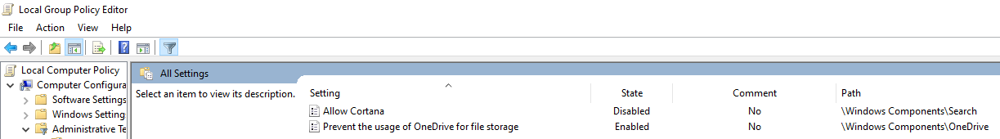

- [前言](#前言)
- [下载最新Windows安装镜像](#下载最新windows安装镜像)
- [使用Rufus制作USB启动盘](#使用rufus制作usb启动盘)
- [UEFI下Secure Boot USB启动盘](#uefi下secure-boot-usb启动盘)
- [Fresh Start](#fresh-start)
- [修改计算机名](#修改计算机名)
- [移动各种User文件夹](#移动各种user文件夹)
- [安装Chocolatey软件管理器和其他软件](#安装chocolatey软件管理器和其他软件)
- [检查Windows更新](#检查windows更新)
- [启用Hyper-V并导入虚拟机](#启用hyper-v并导入虚拟机)
- [禁用多余启动项和功能](#禁用多余启动项和功能)

## 前言

俺自用的Windows 10重装备忘录。

## 下载最新Windows安装镜像

下载[Media Creation Tool](https://www.microsoft.com/software-download/windows10)，运行向导中选择下载ISO。

## 使用Rufus制作USB启动盘

### 下载Rufus

从[官网](https://rufus.ie/)手动下载，或用Chocolatey下载：

```powershell
choco install rufus
```

### 制作启动盘

- 选择要使用的USB盘
- 选择下载的Windows ISO镜像
- 分区类型选择`GPT`、目标系统类型选择`UEFI`
- 文件系统选择FAT32
- `START`开始制作

## UEFI下Secure Boot USB启动盘

俺使用的MSI B150 Krait Gaming，需要开启UEFI、Secure Boot，以及legacy USB support，之后UEFI模式的USB启动才会出现。

## Fresh Start

初次安装Windows 10后再次进行Fresh Start可以彻底排除一堆微软自带的垃圾软件/游戏。手动删除也行，可选步骤。

## 修改计算机名

```text
JayChu-Desktop
```

## 移动各种User文件夹

```text
Desktop
Documents
Downloads
Music
Pictures
Videos
```

## 安装Chocolatey软件管理器和其他软件

管理员模式下，在`cmd.exe`中运行命令[安装Chocolatey](https://chocolatey.org/install)：

```powershell
@"%SystemRoot%\System32\WindowsPowerShell\v1.0\powershell.exe" -NoProfile -InputFormat None -ExecutionPolicy Bypass -Command "iex ((New-Object System.Net.WebClient).DownloadString('https://chocolatey.org/install.ps1'))" && SET "PATH=%PATH%;%ALLUSERSPROFILE%\chocolatey\bin"
```

并安装其他软件：

```powershell
choco install -y 7zip aria2 authy-desktop autohotkey emule Firefox geforce-experience geforce-game-ready-driver git logitech-options logitechgaming steam teamviewer tim toggl vlc vscode wechat
```

以及自行安装一些软件：

```text
GoldenDict
Microsoft Edge Canary
Microsoft Office Professional Plus 2019
PanDownload
QQ音乐
ShadowFox
shadowsocks（之前choco安装的在运行时会受到权限限制，将可执行程序文件拷贝出来自己建立文件夹使用）
```

还要去Microsoft Store中安装一些软件：

```text
Bitwarden
iTunes
Trello
哔哩哔哩动画
哔哩哔哩动画UWP
```

当使用Vim扩展插件时，为了不用经常去够`Esc`和`Ctrl`，Windows下可以使用[`dual-key-remap`](https://github.com/ililim/dual-key-remap)或者[AutoHotKey脚本](https://github.com/escape0707/scripts/blob/master/Use%20CapsLock%20in%20Vim.ahk)，Linux下可以使用[`caps2esc`](https://aur.archlinux.org/packages/interception-caps2esc)。

最后配置GoldenDict词典，以及下载[GoldenDict划译脚本](https://github.com/escape0707/scripts)。

## 检查Windows更新

## 启用Hyper-V并导入虚拟机

## 禁用多余启动项和功能

### 启动项

```text
iTunes Helper
LogiOptions
Logitech Gaming Framework
Microsoft Edge Update
Microsoft Onedrive
Windows Security notification icon
```

### 组策略

`Win+r`：`gpedit.msc`



### 注册表

将下列内容放入`.reg`文件中并运行，移除This PC中的3D Objects、设置启动时打开Num Lock：

```text
Windows Registry Editor Version 5.00
[-HKEY_LOCAL_MACHINE\SOFTWARE\Microsoft\Windows\CurrentVersion\Explorer\MyComputer\NameSpace\{0DB7E03F-FC29-4DC6-9020-FF41B59E513A}]
[-HKEY_LOCAL_MACHINE\SOFTWARE\WOW6432Node\Microsoft\Windows\CurrentVersion\Explorer\MyComputer\NameSpace\{0DB7E03F-FC29-4DC6-9020-FF41B59E513A}]

[HKEY_USERS\.DEFAULT\Control Panel\Keyboard]
"InitialKeyboardIndicators"="2"
```

### 关闭系统托盘区图标

- 麦克风
- 地理位置

### Command History

> Extracted from `%userprofile%\AppData\Roaming\Microsoft\Windows\PowerShell\PSReadline\ConsoleHost_history.txt`.

```ps1
# install scoop
Set-ExecutionPolicy RemoteSigned -scope CurrentUser
iwr -useb get.scoop.sh | iex
# scoop --version

# configure scoop, as scoop ignores aria2's global config
scoop config proxy localhost:7890
scoop install aria2 git
scoop config aria2-max-connection-per-server 16
scoop config aria2-min-split-size 1M
scoop config aria2-split 10000

# configure aria2
mkdir $HOME/.aria2
echo max-connection-per-server=16 >> $HOME/.aria2/aria2.conf
echo min-split-size=1M >> $HOME/.aria2/aria2.conf
echo split=10000 >> $HOME/.aria2/aria2.conf

# configure git
git config --global credential.helper manager
git config --global http.proxy http://localhost:7890
git config --global merge.ff only
git config --global protocol.version 2
git config --global pull.ff only
# git config --global user.email your@email
# git config --global user.name yournickname

# install clash-for-windows
scoop bucket add dorado https://github.com/h404bi/dorado
scoop install clash-for-windows
# and configure clash-for-windows to be the proxy at port 7890 manually...

# install non-portable nvidia-display-driver
scoop bucket add nonportable
scoop install logitech-gaming-software-np
scoop install nvidia-display-driver
# beware that there will be UAC prompts

# install firacode font, there will be UAC prompts, too
scoop bucket add nerd-fonts
scoop install sudo
sudo scoop install FiraCode

# install other apps, copy and remove those you don't need, then paste-run
# or save to a .ps1 file and execute
scoop bucket add extras
scoop bucket add java
scoop install 7zip
scoop install autohotkey
scoop install besttrace
scoop install bitwarden
scoop install firefox-nightly
scoop install gcc
scoop install llvm
scoop install neovim
scoop install nodejs
scoop install openjdk
scoop install python  # this will also install dark & lessmsi?
scoop install screentogif
scoop install steam
scoop install sudo
scoop install sumatrapdf
scoop install teamviewer
scoop install telegram
scoop install vlc
scoop install vscode-insiders
scoop install yarn

# add visual studio code as a context menu option
reg import $HOME\scoop\apps\vscode-insiders\current\vscode-install-context.reg

# configure npm, yarn and install node modules
# WARNING: don't use yrm to set registry as it will break scoop's yarn path settings
npm config set registry https://mirrors.cloud.tencent.com/npm/
yarn config set registry https://mirrors.cloud.tencent.com/npm/
# npm config set proxy http://localhost:7890
# yarn config set proxy http://localhost:7890
yarn global add @typescript-eslint/eslint-plugin
yarn global add @typescript-eslint/parser
yarn global add eslint
yarn global add eslint-config-prettier
yarn global add prettier
yarn global add rimraf
yarn global add typescript

# configure pip and install python modules
pip install -i https://mirrors.cloud.tencent.com/pypi/simple --upgrade pip
pip config set global.index-url https://mirrors.cloud.tencent.com/pypi/simple
pip install bandit
pip install black
pip install flake8
pip install mypy
pip install pip-autoremove

## choco related. please run in an admin shell
# install choco
Set-ExecutionPolicy Bypass -Scope Process -Force; [System.Net.ServicePointManager]::SecurityProtocol = [System.Net.ServicePointManager]::SecurityProtocol -bor 3072; iex ((New-Object System.Net.WebClient).DownloadString('https://chocolatey.org/install.ps1'))
choco --version
# configure choco
choco config set proxy http://localhost:7890
choco feature enable -n allowGlobalConfirmation
# install apps
choco install authy-desktop
choco install geforce-experience
choco install tim
choco install toggl
```
